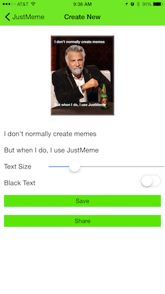

# JustMeme

JustMeme is a NativeScript-built iOS and Android app for creating memes and sharing them with your friends and family.




## Download

[](https://itunes.apple.com/us/app/justmeme/id989340374?mt=8)

## Development

This app was built with the [NativeScript CLI](https://github.com/NativeScript/nativescript-cli). Once you have the [CLI installed](https://github.com/NativeScript/nativescript-cli#installation), use the following commands to run JustMeme:

```bash
$ git clone https://github.com/NativeScript/JustMeme.git
$ cd JustMeme
$ tns platform add ios
$ tns run ios --emulator
```