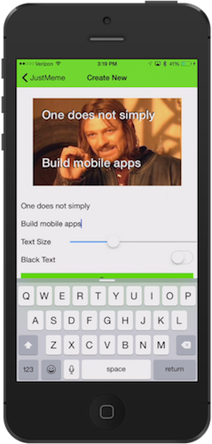

# JustMeme

JustMeme is a NativeScript-built iOS and Android app for creating memes and sharing them with your friends and family.




## Download

[](https://itunes.apple.com/us/app/justmeme/id989340374?mt=8)

## Development

This app was built with the [NativeScript CLI](https://github.com/NativeScript/nativescript-cli). Once you have the [CLI installed](https://github.com/NativeScript/nativescript-cli#installation), use the following commands to setup JustMeme:

```
$ git clone https://github.com/NativeScript/JustMeme.git
$ cd JustMeme
$ tns platform add ios
```

Next you'll have to switch to the `app` directory and install the necessary dependencies from npm:

```
$ cd app
$ npm install
```

And finally you can run the app on your device of choice:

```
$ tns run ios --emulator
```

JustMeme uses Gulp to automate JSHint for code linting. To run it just run `gulp` within the `app` directory:

```
$ gulp
```